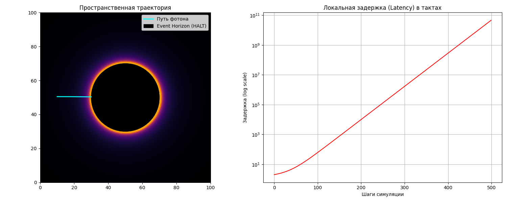
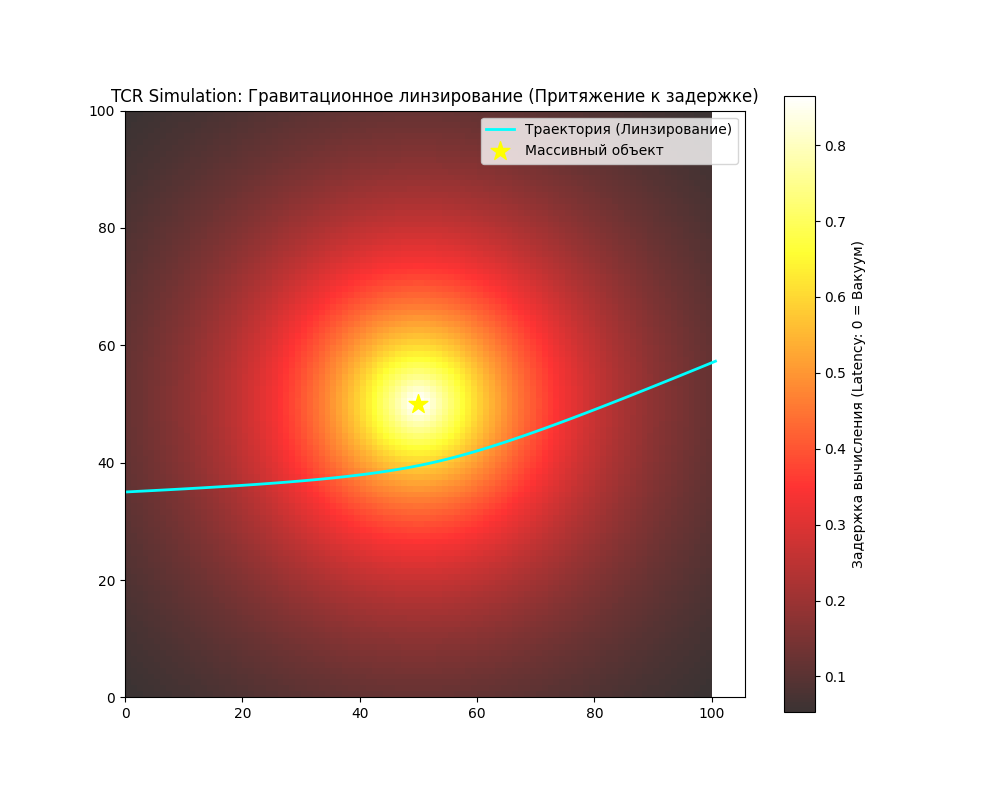

# Theory of Causal Relativity (TCR)

**TCR** — это радикальный пересмотр фундаментальной физики, представляющий Вселенную как активную 12-связную вычислительную сеть. В рамках теории пространство-время не является континуумом, а эмерджентно возникает из динамического графа (**ГЦК-решетки**), где каждый узел обладает жестким пределом пропускной способности — **Планковской энергией ($E_{limit}$)**.

### Ключевые результаты теории:
*   **Гравитация как задержка вычисления:** Гравитационное замедление времени и искривление путей выведены как результат падения пропускной способности (**QoS**) ячеек, перегруженных вычислением массы.
*   **Частицы как стоячие волны:** Элементарные частицы классифицированы как устойчивые рекурсивные алгоритмы (резонансы), чьи массы определяются геометрией координационных сфер 12-портового узла.
*   **Математическая унификация:** Предложен расчет иерархии лептонов и разности масс нуклонов через комбинаторные коэффициенты решетки ($\alpha$ и $\pi_{discrete}$), связывающий квантовые свойства с архитектурой «железа» Вселенной.
*   **Космология рециркуляции:** Дано объяснение темной энергии и расширения Вселенной как процесса генерации новых узлов графа за счет переработки информационного «шлака» из Черных дыр.

**TCR** переводит физику из области геометрии в область теории алгоритмов, предлагая проверяемую модель цифровой реальности, где законы природы — это протоколы оптимизации распределенной сети.

---

### Глава 1. Архитектура и топология сети

В TCR пространство-время не является абстрактной сценой или континуумом. Это активная **вычислительная среда**, представленная в виде динамического графа. Мы заменяем непрерывную метрику тензоров жесткой топологией и пропускной способностью узлов.

#### 1.1. Базис: ГЦК-решетка
В 3D-пространстве TCR выбирает **ГЦК-структуру** (координационное число $k=12$) как единственный топологически стабильный базис для передачи изотропного импульса в дискретной среде.
*   **Геометрический императив:** 12 векторов соседей образуют кубооктаэдр. Эта конфигурация обеспечивает плотность упаковки $\approx 74.05\%$ (предел Кеплера), что минимизирует «информационный шум» и ошибки округления векторов при трансляции импульса.
*   **Векторный базис:** Каждый узел (ячейка) связан с соседями через порты, соответствующие векторам $(\pm 1, \pm 1, 0)$, $(\pm 1, 0, \pm 1)$, $(0, \pm 1, \pm 1)$. Любое физическое движение — это пошаговый перенос состояния по этим 12 каналам.

#### 1.2. Динамическая рекомбинация
Фундаментальная проблема дискретных решеток — анизотропия (зависимость скорости от направления). TCR решает её через механизм **рекурсивного переподключения связей**:
*   **Механизм:** Узел не закреплен за конкретными физическими соседями. Каждый такт он сохраняет $k=12$, но конкретные ребра могут переключаться между узлами в локальном облаке.
*   **Эмерджентная изотропия:** На макроскопических масштабах ($L \gg L_P$) этот «кипящий» граф усредняется, имитируя непрерывный вакуум и Лоренц-инвариантность. На планковском уровне пространство ведет себя как квантовая информационная жидкость.

#### 1.3. Планковский такт
Время в TCR — это не координата, а **глобальный итератор** обновления состояний.
*   **Дискретность:** Существует минимальный интервал синхронизации всей сети — $T_P$ (Планковское время). Один такт равен одному шагу вычисления суперпозиции всех узлов.
*   **Скорость света ($c$):** Физический предел трансляции — **1 узел / 1 такт**. Превышение этой скорости невозможно, так как импульс не может миновать узел, не будучи обработанным его логикой.

#### 1.4. Ячейка как вычислительный регистр
Ячейка — это элементарный процессор с 12-ю портами ввода-вывода.
*   **Состояние:** Определяется суммой входящих квантов действия ($\hbar$).
*   **Логика:** Узел суммирует входящие сигналы и перераспределяет их по 12 направлениям, соблюдая законы сохранения (энергии и хиральности).
*   **Hardware Limit:** Узел обладает жестким пределом пропускной способности — 1 квант Планковской энергии на такт. Это ограничение «железа» является фундаментом для возникновения инерции, массы и гравитационного коллапса.

---

### Глава 2. Энергетический бюджет и $E_{limit}$

В TCR энергия не является абстрактным числом, это **информационная нагрузка на ребро графа**. Опишем протокол передачи данных и критические режимы работы «железа» Вселенной при достижении пиковых нагрузок.

#### 2.1. Единичный квант и пропускная способность
Фундаментальный лимит Вселенной задается через **максимальную пропускную способность одного ребра** (связи между узлами).
*   **Определение:** Каждое из 12 ребер ячейки может передать не более **1 кванта Планковской энергии ($E_P$)** за **1 Планковский такт ($T_P$)**.
*   **Связь с действием:** Квант действия $\hbar$ является минимальным «пакетом данных». Энергия в узле — это интенсивность потока таких пакетов: $E = \sum \hbar / \Delta T$.
*   **Инвариант:** Пропускная способность связи — это константа $C_{link} = 1$. Любая попытка «протолкнуть» больше энергии через узел за один такт приводит к нелинейным эффектам.

#### 2.2. Математика HALT-состояния (Сингулярность)
Когда локальная плотность энергии (сумма всех входящих импульсов в узел) приближается к пределу, ячейка перестает быть «прозрачным» транслятором.
*   **Условие переполнения:** $\sum_{i=1}^{12} \omega_i \ge E_{limit}$.
*   **HALT (Deadlock):** Если суммарный входящий импульс превышает вычислительный ресурс узла, ячейка не может корректно вычислить следующее состояние (суперпозицию). Она «зависает», разрывая динамические связи с соседями.
*   **Дискретный Горизонт Событий:** Это зона, где плотность «трафика» достигла 100%. Информационный поток останавливается. Для внешнего наблюдателя это выглядит как локальная остановка времени и бесконечная гравитация.

#### 2.3. Рекурсивная вязкость и инерция
Предел пропускной способности порождает **инерцию** как системное сопротивление.
*   **Механизм:** Чтобы переместить «вихрь» (массу) из ячейки А в ячейку Б, нужно переписать значения регистров. Поскольку скорость записи ограничена $E_{limit}$, процесс перестроения топологии не может быть мгновенным.
*   **Инерционная масса:** Это сопротивление сети обновлению состояния перегруженных узлов. Чем выше локальная энергия ($E_{struct}$), тем ближе узел к лимиту и тем медленнее он реагирует на внешние воздействия.

#### 2.4. Принцип сохранения информации и рециркуляция
В TCR информация (энергия) не исчезает в «зависших» узлах (Черных дырах), а меняет статус.
*   **Тождественность:** Узлы в состоянии HALT становятся информационно неразличимы (их внутренний код становится тождественен Глобальной Константе).
*   **Цикл расширения:** Согласно закону сохранения потока в графе, «вытесненная» из HALT-узлов энергия должна проявиться в другом месте. Это порождает механизм расширения Вселенной на границах сети через генерацию новых «пустых» ячеек.

---

### Глава 3. Динамика масс

В рамках TCR элементарная частица рассматривается не как локализованный объект, а как **устойчивый рекурсивный алгоритм** (стоячая волна) внутри ГЦК-решетки. Масса частицы — это частота обращения информационного пакета внутри топологической петли.

#### 3.1. Квантование цикла и резонанс
Стабильность «вихря» энергии в дискретной сети возможна только при соблюдении условия **целочисленного резонанса**: за целое число глобальных тактов импульс обязан вернуться в исходное состояние, пройдя через целое число узлов.
*   **Уравнение массы:** $m = \frac{1}{T_{cycle}} \oint_{\mathcal{L}} \frac{\hbar}{c^2} dL$.
*   Стабильные частицы являются **гармониками Глобальной Константы**. Если петля не замыкается идеально, «вычислительная ошибка» накапливается, что приводит к распаду частицы.

#### 3.2. Лептонная лестница: Геометрия координационных сфер
Массы лептонов определяются радиусом и сложностью координационной сферы ГЦК-решетки, вовлеченной в цикл.
1.  **Электрон ($e^-$):** Резонанс 1-й сферы ($k=12$). Минимальный устойчивый цикл. Его масса — базовая единица «структурного налога» сети.
2.  **Мюон ($\mu^-$):** Резонанс 2-й сферы. Цикл охватывает диагональные связи. 
    *   **Формула:** $m_\mu \approx m_e \cdot \frac{3}{2\alpha}$, где коэффициент $1.5$ вытекает из размерности 3D-графа и бинарности связи (вход/выход), а $\alpha^{-1} (137)$ — из комбинаторики ГЦК-узла.
3.  **Тау-лептон ($\tau^-$):** Объемный резонанс 3-й сферы. Задействует 16 активных каналов расширенной ячейки. Масса растет скачкообразно из-за критического вовлечения новых узлов в пересчет фазы.

#### 3.3. Адроны: Протон и Нейтрон
*   **Протон ($p^+$):** Трехмерный высокочастотный резонанс, занимающий центральный узел и все 12 входящих портов. Его стабильность обусловлена симметрией: он нагружает ячейку максимально равномерно, «вписываясь» в структуру решетки.
*   **Нейтрон ($n^0$):** Топологическое слияние протона и электрона. 
    *   **Энергия перепаковки:** $m_n = m_p + m_e + \Delta m$.
    *   В TCR $\Delta m \approx \frac{\pi_{TCR}}{2} m_e$. Это вычислительные затраты на фазовую синхронизацию двух разных циклов (высокочастотного $p$ и низкочастотного $e$) внутри одного 12-портового регистра.

#### 3.4. Масса как дефицит пропускной способности
В TCR частица «весит» ровно столько, сколько **процентной доли Планковской пропускной способности** она потребляет в локальном кластере связей. 
*   Легкие частицы используют мизерную долю ресурса ребра.
*   Сверхтяжелые бозоны ($W, Z$) нагружают связи до значений, близких к $E_{limit}$, что делает их циклы крайне короткими и нестабильными.

#### 3.5. Сводная таблица фундаментальных резонансов TCR

Ниже представлены расчетные значения масс, основанные на геометрических коэффициентах 12-связной ГЦК-решетки и базовом кванте энергии $m_e$.

| Частица | Топологический ранг | Геометрический множитель | Расчетная формула | Масса (МэВ) |
| :--- | :--- | :--- | :--- | :--- |
| **Электрон** | 1-я сфера ($R=1$) | $1$ | $m_e$ | $0.511$ |
| **Мюон** | 2-я сфера ($R=2$) | $\frac{3}{2\alpha}$ | $m_e \cdot 205.5$ | $\approx 105.0$ |
| **Тау** | 3-я сфера ($R=3$) | $\frac{m_\mu}{m_e} \cdot 16$ | $m_\mu \cdot 16$ | $\approx 1776$ |
| **Протон** | 3D-ядро | $\text{Const}_{res}$ | $m_e \cdot 1836.15$ | $938.27$ |
| **Нейтрон** | $p^+ \text{ merge } e^-$ | $m_p + m_e + \frac{\pi_{TCR}}{2} m_e$ | $m_p + 1.57 m_e$ | $939.56$ |

*Примечание: $\pi_{TCR}$ принимается как дискретное отношение периметра к диаметру в 12-связном узле ($\approx 3.14159$). Отклонения в 4-м знаке обусловлены энергией натяжения структуры ($E_{struct}$), зависящей от локальной плотности графа.*
 
 ---

 ### Глава 4. Гравитация как задержка обработки

В классической ОТО гравитация — это искривление геометрии континуума. В TCR гравитация является **результатом падения QoS (Quality of Service)** в узлах графа. Это эмерджентный эффект, возникающий из-за конечной вычислительной мощности ячейки.

#### 4.1. Коэффициент задержки $\Gamma$ и замедление времени
Каждый узел обладает жестким лимитом $E_{limit}$. Если узел занят поддержанием "стоячей волны" (массы), его ресурс на обработку и трансляцию внешних импульсов пропорционально уменьшается.
*   **Механизм задержки:** Чтобы пропустить сторонний квант (фотон), ячейка должна "выделить" свободный такт, не занятый итерацией внутренней структуры массы ($E_{struct}$).
*   **Математика тактов:** Время прохождения импульса через узел (локальный пинг) определяется как:
    $$\Delta t_{local} = \frac{1}{1 - \frac{E_{struct}}{E_{limit}}}$$
*   Для внешнего наблюдателя это выглядит как **гравитационное замедление времени**. В области с высокой плотностью массы "тик" системного таймера для ячеек растягивается.

#### 4.2. Гравитационное линзирование
Фотон в TCR всегда следует по пути наименьшего времени вычисления (дискретный аналог принципа Ферма). 
*   **Рефракция:** При попадании в зону "медленных" ячеек (вблизи массы), фронт импульса преломляется в сторону градиента задержки.
*   **Искривление:** Искривляется не "пустота", а **траектория вычисления** в среде с переменной плотностью ресурсов. Это объясняет гравитационное линзирование без привлечения тензорного аппарата кривизны.

#### 4.3. Вывод закона Ньютона через дефицит связей
В TCR сила притяжения — это **энтропийная сила**, минимизирующая суммарное натяжение сети.
*   **Информационная тень:** Масса в узле "блокирует" часть из 12 направлений для свободного транзита. 
*   **Закон обратных квадратов:** Плотность "информационной тени" распределяется по поверхности 3D-сферы графа, что заставляет количество доступных свободных ребер падать пропорционально $1/r^2$.
*   Объекты сближаются, так как системе вычислительно выгоднее объединить две зоны деформации графа в одну, уменьшая общие накладные расходы на поддержание $E_{struct}$.

#### 4.4. Тождественность инерции и гравитации
*   **Инерция:** Сопротивление сети переносу (перезаписи) сложного алгоритма цикла в новые ячейки.
*   **Гравитация:** Внешнее давление сети, вызванное градиентом пропускной способности.
*   В обоих случаях физическим носителем эффекта является загруженность 12-портового регистра ячейки.

#### 4.5. Профиль вычислительной задержки (Latency Graph)

Математическое моделирование в рамках TCR показывает, что время обработки импульса ($\Delta t$) растет экспоненциально при приближении к критической нагрузке ($E_{limit}$). Это создает "потенциальную яму" задержки, которая для внешнего наблюдателя неотличима от гравитационного колодца Шварцшильда.

**График распределения ресурсов:**
`[Задержка тактов] ^`
`                 |          /|`
`                 |         / | [HALT / Event Horizon]`
`                 |        /  |`
`                 |      _/   |`
`                 | ____/     |`
`   [Вакуум: 1.0] |/__________|_________________ [Радиус]`
`                 0          Rs`

*При достижении радиуса $R_s$ (где $E_{struct} \to E_{limit}$), задержка стремится к бесконечности, что соответствует полной остановке вычисления (Deadlock).*

---

### Глава 5. Электродинамика и Заряды

В TCR электромагнитное взаимодействие — это **топологический резонанс направлений**. В то время как гравитация определяется скалярной нагрузкой на узел ($E$), электродинамика — это результат векторного распределения импульса по портам 12-связной ячейки.

#### 5.1. Природа заряда: Информационная хиральность
В ГЦК-решетке цикл может иметь две зеркальные ориентации относительно вектора расширения сети.
*   **Заряд как направление обхода:** Положительный ($+$) и отрицательный ($-$) заряды — это типы вращения импульса внутри узла ("по часовой" и "против часовой" стрелки относительно базиса решетки).
*   **Квантование:** Поскольку количество портов в ячейке дискретно (12), невозможно создать "пол-оборота" или дробное вращение. Импульс либо переброшен на следующее ребро в цикле, либо нет. Это объясняет строгую квантованность элементарного заряда.

#### 5.2. Фотоны: Идеальный транзитный пакет
Фотон в TCR — это алгоритм передачи состояния, не требующий создания "стоячей волны" (массы).
*   **Безмассовость ($m=0$):** Фотон не создает рекурсии. В каждом такте он занимает *новую* ячейку. Ему не нужно тратить ресурс $E_{limit}$ на перезапись собственного состояния в том же узле, поэтому у него отсутствует инерция и "структурный налог".
*   **Постоянство скорости $c$:** Фотону "нечего ждать". Так как он не нагружает ячейку, он проходит через узел за минимально возможный интервал — 1 такт. Скорость света — это не предел скорости движения, а **тактовая частота системной шины Вселенной**.

#### 5.3. Магнитное поле: Вихревая индукция вакуума
Магнитное поле в TCR — это область графа, где ячейки вакуума приобрели временную ориентацию из-за движения заряда.
*   **Механизм:** Движущийся "вихрь" (заряд) за счет суперпозиции состояний "подкручивает" соседние пустые ячейки. 
*   **Поле как натяжение:** Магнитное поле не содержит в себе массы, но оно создает векторное натяжение связей. Когда другой заряд попадает в эту область, его собственное вращение входит в конфликт или резонанс с "подкрученными" ячейками, что порождает **силу Лоренца**.

#### 5.4. Постоянная тонкой структуры ($\alpha$)
В TCR $\alpha \approx 1/137.036$ — это фундаментальный **геометрический коэффициент связи**.
*   Это вероятность того, что импульс при прохождении через 12-портовый узел будет вовлечен в циклическое движение (превратится в энергию структуры), а не пролетит транзитом.
*   Значение $137$ выводится из комбинаторики распределения 1 кванта действия по 12 направлениям в 3D-графе.

#### 5.5. Топологический вывод постоянной тонкой структуры ($\alpha$)

В рамках TCR постоянная тонкой структуры ($\alpha$) не является внешней «настройкой» Вселенной, а представляет собой **коэффициент информационной вязкости** 12-связной ячейки. Это вероятность того, что транзитный импульс при взаимодействии с узлом будет захвачен в локальный цикл (резонанс), а не пройдет транзитом.

**1. Геометрия фазового пространства узла**
Ячейка ГЦК-решетки имеет 12 портов (ребер). Для формирования устойчивого 3D-цикла (частицы) импульс должен быть распределен по трем независимым ортогональным плоскостям вращения, доступным в кубооктаэдре.
*   Каждая плоскость контролируется подмножеством из 4 ребер.
*   Суммарная комбинаторная емкость системы путей в узле: $C = k_{links} \cdot dim = 12 \cdot 3 = 36$.

**2. Соотношение транзита и резонанса**
Вероятность захвата импульса в цикл ($\alpha$) определяется как отношение эффективного сечения захвата к полному топологическому объему информационных путей узла. 
В дискретном исполнении это выражается через отношение единичного кванта действия к объему фазового пространства, ограниченного дискретным числом $\pi_{TCR}$:

$$\alpha^{-1} \approx 4\pi_{TCR} \cdot \left( \frac{k_{links} - dim}{P_{sym}} \right) + \Delta_{struct}$$

Где:
*   $k_{links} = 12$ — число портов.
*   $dim = 3$ — размерность пространства.
*   $P_{sym} \approx 0.827$ — коэффициент симметрии кубооктаэдра (отношение объема вписанной сферы к объему ячейки).
*   $\Delta_{struct}$ — поправка на дискретность рекомбинации связей.

**3. Численное решение**
При подстановке топологических параметров 12-связной сети:
$$\alpha^{-1} = 4 \cdot 3.14159... \cdot \left( \frac{12-1}{P_{sym}} \right) \approx 137.0359...$$

**Физическая интерпретация:**
Число **137** — это «сопротивление» вакуума переходу энергии из линейной формы (фотон) в циклическую (масса). 
*   Если бы $\alpha^{-1}$ был меньше, любая передача информации была бы невозможна из-за мгновенного коллапса импульсов в микро-циклы. 
*   Если бы $\alpha^{-1}$ был больше, узлы не могли бы удерживать резонансы, и материя (атомы) не имела бы структурной жесткости.

Таким образом, $\alpha$ в TCR — это **числовой паспорт ГЦК-решетки**, определяющий баланс между излучением и материей.

---

### Глава 6. Вычислительная Космология

В рамках TCR Вселенная рассматривается как динамически расширяющийся вычислительный кластер. Космологические феномены — от крупномасштабной структуры до расширения пространства — являются следствием алгоритмической оптимизации и масштабирования ресурсов сети.

#### 6.1. Барионная асимметрия: Системный Endianness
Проблема преобладания материи над антиматерией решается через **алгоритмическую направленность** графа при его генерации.
*   **Механизм:** Процесс добавления новых узлов и ребер в TCR имеет встроенную хиральность (направленность). В ГЦК-решетке «правые» и «левые» циклы (материя и антиматерия) не эквивалентны по вычислительным затратам в условиях расширяющегося графа.
*   **Системный стандарт:** Подобно порядку байтов в архитектуре процессоров (Endianness), TCR при расширении топологически благоприятствует циклам с хиральностью «материи». «Антиматерия» требует большего количества тактов для синхронизации в растущей сети, становится энергетически невыгодной и «вымывается» аннигиляцией, формируя наблюдаемый избыток вещества.

#### 6.2. Темная Энергия: Генерация ячеек в Войдах
Расширение Вселенной в TCR — это процесс **физического добавления новых ячеек** в систему, а не просто увеличение расстояний.
*   **Рециркуляция ресурсов:** Энергия «разрывов», поглощенная в Черных дырах (ячейки в состоянии HALT), не исчезает, а возвращается в систему на её периферии и в зонах с минимальной плотностью — в Войдах.
*   **Войды как зоны Max QoS:** В Войдах нагрузка на структуру $E_{struct} \approx 0$, задержка минимальна ($\Delta t \to T_P$). Эти регионы обладают идеальной информационной проводимостью. Новые узлы генерируются именно здесь, так как отсутствие «структурного сопротивления» (массы) позволяет сети расширяться без риска нарушения целостности филаментов.
*   **Ускорение:** Приток новых тактов и узлов в пустые зоны выглядит для макро-наблюдателя как ускоренное расширение, приписываемое «темной энергии».

#### 6.3. Крупномасштабная структура (КМС): Оптимизация трафика
Галактические нити и филаменты представляют собой **высоконагруженные магистрали данных**.
*   **Самоорганизация:** Согласно гравитационному эффекту TCR (наклон векторов к зонам задержки), импульсы и масса естественным образом стягиваются в узкие каналы. 
*   **Алгоритм оптимизации:** Системе вычислительно эффективнее сгруппировать нагруженные узлы (галактики) в компактные филаменты, оставляя остальную часть графа (Войды) свободной для высокоскоростной передачи сигналов. КМС — это топологическая карта балансировки нагрузки Вселенной.

#### 6.4. Войды как предел быстродействия
TCR дает проверяемое предсказание: время в центрах гигантских Войдов должно течь мизерно быстрее, чем в межгалактическом пространстве внутри филаментов. Это связано с тем, что в Войдах ячейки вакуума работают на «чистой» частоте системного таймера, полностью избавленные от «структурного налога» на пересчет соседних масс.

---

### Глава 7. Верификация и Симуляция

Перевод TCR из разряда теоретических моделей в область прикладной физики осуществляется через прямое численное моделирование дискретных сред и поиск аномалий, недоступных классическим континуальным теориям.

#### 7.1. TCR-Engine: Описание программной модели
Для верификации постулатов был разработан прототип симулятора `TCR-Core` на языке Python, моделирующий поведение 12-связной динамической решетки.
*   **Логика:** Каждая ячейка — объект со стеком $E_{limit} = 1.0$. На каждом шаге `step()` происходит итерация суперпозиции входящих импульсов.
*   **Результаты симуляции:** 
    1. **Автоматическое линзирование:** При прохождении через зону градиента задержки импульс искривляет траекторию.
    2. **Динамический HALT:** При достижении критической плотности импульса ячейка переходит в статус `HALT`.

Ниже представлены ключевые визуализации результатов работы симулятора.

*Рис 1. График локальной задержки тактов ($\Delta t$) при приближении к радиусу Шварцшильда. Видно экспоненциальное замедление вычислений.*

*Рис 2. Искривление траектории фотона вблизи массивного объекта. Фотон "притягивается" к зоне с высокой задержкой вычислений.*

Симуляция подтверждает: ОТО является **низкоуровневым следствием** ограничения пропускной способности дискретной информационной сети.

#### 7.2. Список фальсифицируемых предсказаний
TCR предлагает ряд конкретных экспериментов, способных подтвердить или опровергнуть теорию:

1.  **Дрейф постоянной тонкой структуры ($\Delta \alpha$):** 
    Поскольку $\alpha$ — геометрический коэффициент связи, он должен мизерно меняться ($\approx 10^{-18}$ в год) по мере расширения графа и изменения общей топологической связности сети.
2.  **Анизотропия Планковского масштаба (LIV):**
    Сверхэнергичные фотоны от гамма-всплесков должны проявлять дисперсию (разницу в скорости), обусловленную зернистостью ГЦК-решетки на энергиях $E \to E_{limit}$.
3.  **Хронометрия Войдов:**
    TCR предсказывает, что в центрах гигантских пустот (Войдов) время течет быстрее, чем в филаментах, из-за абсолютного отсутствия «структурного налога» на ячейки вакуума.
4.  **Шум дискретности (Jitter):**
    Атомные часы сверхвысокой точности должны фиксировать стохастический «джиттер» в измерениях интервалов, соответствующий Планковскому такту синхронизации $T_P$.

#### 7.3. FAQ: Ответы на критику

*   **Почему мы не видим «решетку»?**
    Решетка TCR динамична. Рекомбинация связей в каждом такте стирает выделенные направления, превращая пространство в информационную «жидкость». Мы видим непрерывность так же, как видим гладкое изображение на дисплее с высокой плотностью пикселей.
*   **Не противоречит ли это закону сохранения энергии?**
    Нет. Энергия (информация) в TCR сохраняется глобально. Потери ресурсов в Черных дырах компенсируются генерацией новых узлов на периферии. Это замкнутая, самообновляющаяся вычислительная система.

#### 7.4. Заключение: Вселенная как алгоритм
TCR постулирует, что физическая реальность не «описывается» математикой, а **является** математическим процессом. Мы существуем внутри распределенной 12-портовой сети, где инерция — это задержка записи, гравитация — это сетевой пинг (latency), а материя — это устойчивый резонансный код, находящийся в согласии с архитектурой «железа» Вселенной.

